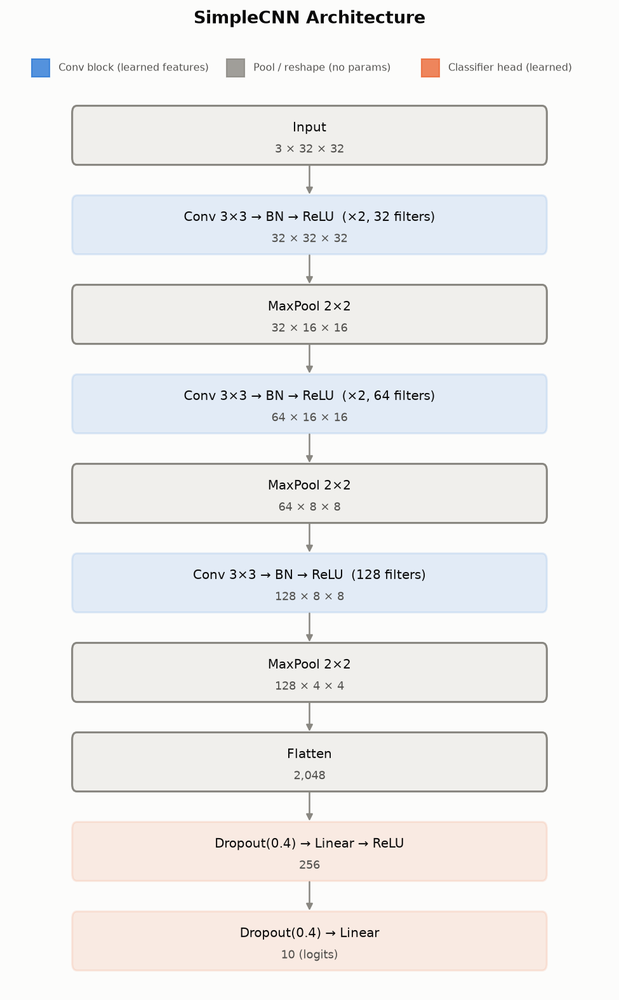
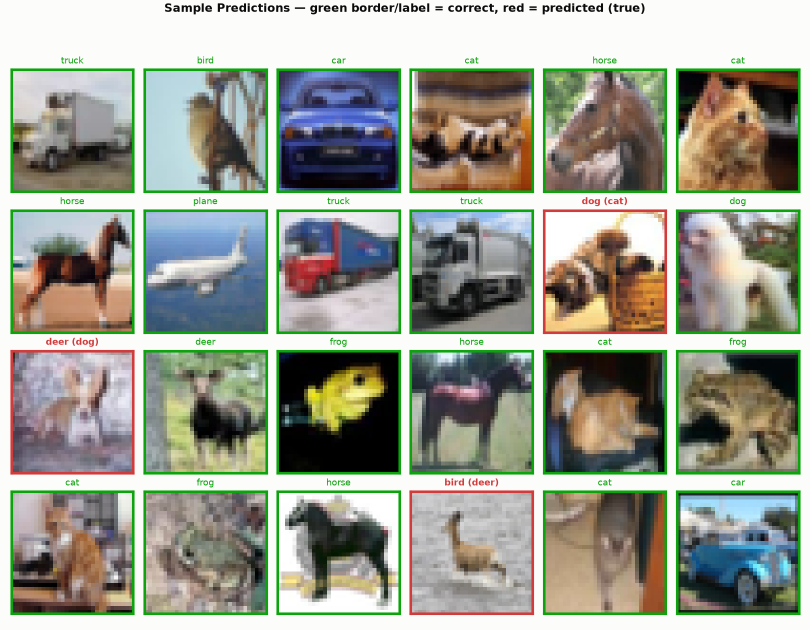
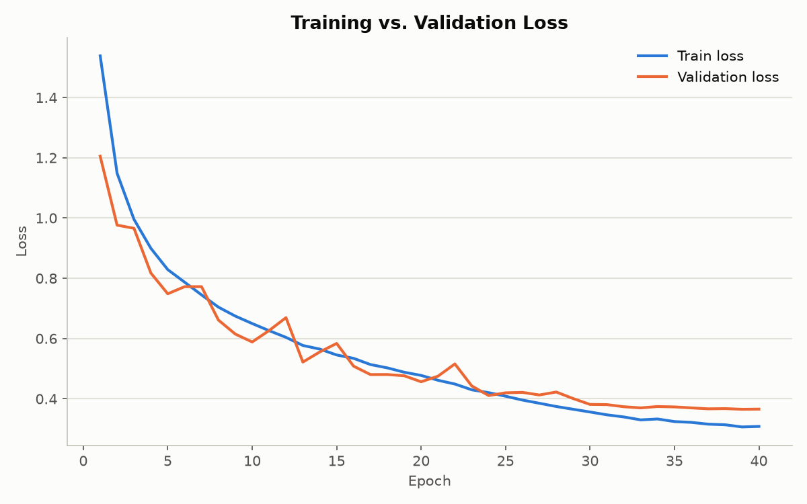
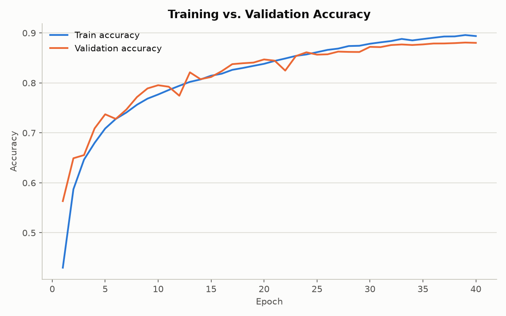
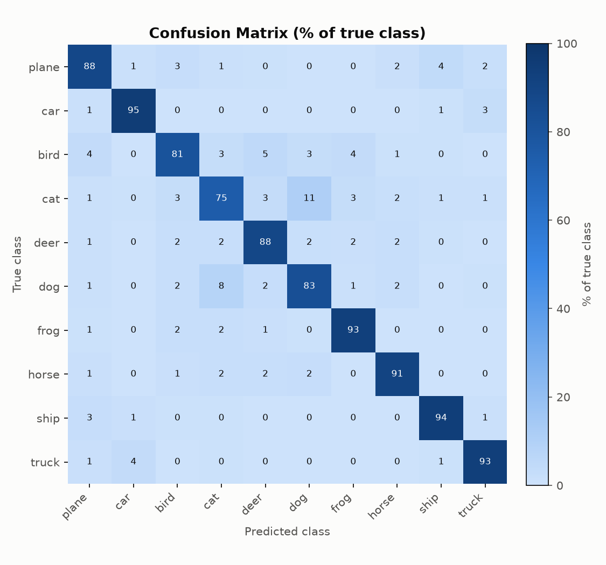
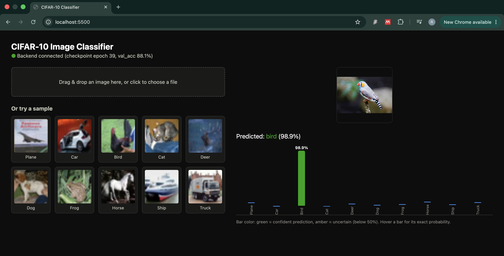

# CIFAR-10 Image Classification (PyTorch)

A small CNN trained from scratch on CIFAR-10.



## Setup

```bash
python3.11 -m venv .venv
source .venv/bin/activate
pip install -r requirements.txt
```

## Train

```bash
python ml/train.py --epochs 40 --batch-size 128 --lr 1e-3 --patience 5
```

CIFAR-10 downloads automatically to `./data` on first run. The best checkpoint
(by validation accuracy) is saved to `./checkpoints/best_model.pt`, and
per-epoch loss/accuracy is logged to `./checkpoints/history.json`. Training
stops early if validation accuracy doesn't improve for `--patience` epochs.
See [docs/TRAINING.md](docs/TRAINING.md) for details.

## Evaluate

```bash
python ml/evaluate.py
```

Prints overall test accuracy and per-class accuracy for the saved checkpoint.

## Results

Current best checkpoint: **88.08%** validation accuracy (epoch 39/40).

**Sample predictions** (green border = correct, red = predicted (true)):



**Loss and accuracy over training:**




**Confusion matrix** (row-normalized, % of each true class):



Regenerate all of these after any training run:

```bash
python scripts/plot_history.py             # loss_curve.png, accuracy_curve.png
python scripts/plot_confusion_matrix.py     # confusion_matrix.png
python scripts/plot_sample_predictions.py   # sample_predictions.png
```

## Web app

A backend + frontend for interactively classifying images with the saved
checkpoint. Run as two separate local servers.



Generate the 10 sample images (one per class) shown on the page, once:

```bash
python scripts/generate_samples.py
```

Start the backend (port 8000):

```bash
uvicorn app:app --app-dir app/backend --port 8000
```

Start the frontend (port 5500), in a second terminal:

```bash
python3 -m http.server 5500 --directory app/frontend
```

Then open http://localhost:5500 in a browser. Drag/drop or upload an image,
or click one of the 10 sample thumbnails, to see the model's predicted class
probabilities as a bar chart.

## Structure

```
ml/
  config.py    training hyperparameters and paths
  dataset.py   CIFAR-10 loading + augmentation
  model.py     SimpleCNN architecture
  train.py     training loop, checkpointing
  evaluate.py  test-set evaluation
app/
  backend/
    app.py               FastAPI inference API (/api/predict, /api/classes, /api/health)
  frontend/
    index.html, style.css, app.js   drag-drop UI + bar chart
    samples/                        generated sample images, one per class
scripts/
  generate_samples.py         regenerates app/frontend/samples/ from the CIFAR-10 test set
  plot_history.py             renders docs/loss_curve.png + accuracy_curve.png
  plot_confusion_matrix.py    renders docs/confusion_matrix.png
  plot_sample_predictions.py  renders docs/sample_predictions.png
  plot_architecture.py        renders docs/architecture.png
notebooks/
  inference_visualization.ipynb   notebook version of the same predict + bar-chart flow
docs/
  TRAINING.md              how the training pipeline works
  web_app_screenshot.png   screenshot of the web app in action
  *.png                    charts generated by scripts/plot_*.py, embedded above
```
